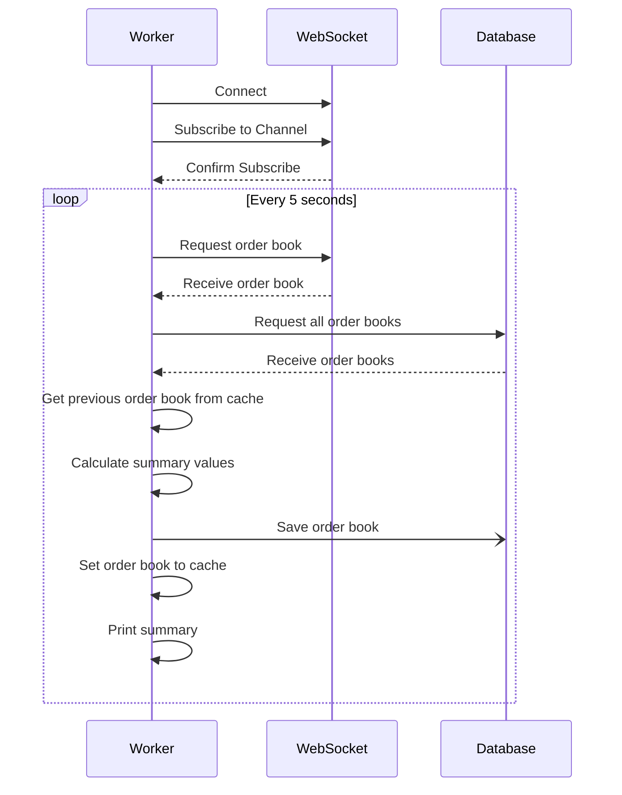
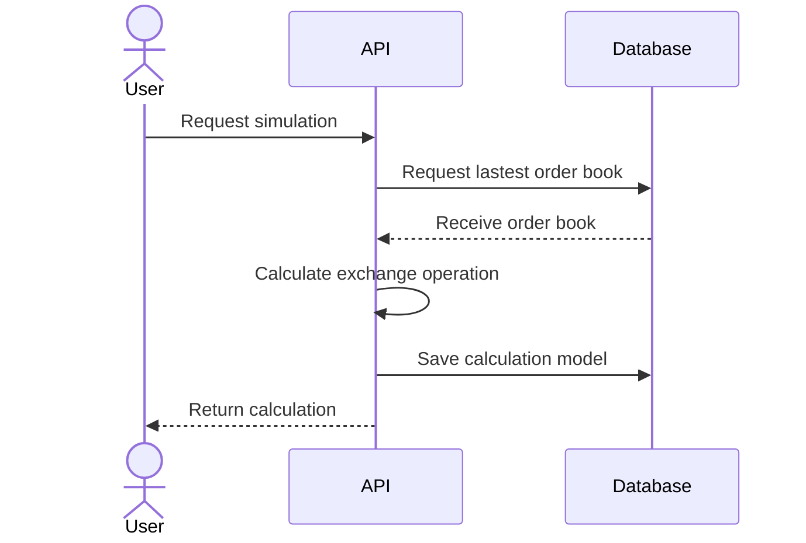

# DesafioB3Digitas

## Sumário
Esta solução contém um micro-serviço responsável pela ingestão dos dados fornecidos  pelo Web Socket da Bitstamp¹ no canal **Live order book**. Os dados serão salvos em um banco não relacional ²

O micro-serviço também contém um API que fornece uma simulação de operação de Compra ou Venda de uma determinada moeda (ex.: BTC/USD)

### Moedas disponíveis

* BTC/USD
* ETH/USD

## Versão do .NET
É necessário ter instalado o [.NET 7](https://dotnet.microsoft.com/en-us/download/dotnet/7.0)

## Projetos

* **CurrencyIngestion.Worker**
    
  A camada da aplicação. Responsável pela integração do serviço do Web Socket do Bitstamp¹

* **CurrencyIngestion.API**
  
  A _API_ que fornece as operações de simulação de compra ou venda
  
* **CurrenyIngestion.Domain**
  
  A camada dos domínios. São eles:
  * Sumário das moedas ([CurrencySummary](CurrencyIngestion.Domain/CurrencySummary.cs))
  * Carteira de pedidos ([OrderBook](CurrencyIngestion.Domain/OrderBook.cs))
  * Operação de Compra ou Ask ([AskOperation](CurrencyIngestion.Domain/AskOperation.cs))
  * Operação de Venda ou Bid ([BidOperation](CurrencyIngestion.Domain/BidOperation.cs))
  * Simulação de operação de câmbio ([ExchangeSimulation](CurrencyIngestion.Domain/ExchangeSimulation.cs))

* **CurrencyIngestion.Service**
  
  A camada de serviços dos domínios

* **CurrencyIngestion.Data**
  
  A camada de leitura e escrita dos dados em repositórios. Contém tambéms os objetos de transferência de dados (_DTOs_)

* **CurrencyIngestion.Common**
  
  Classes comuns que podem ser utlizadas em todos os projetos. Não pode conter referências a outros projetos

## Executando o serviço

Para executar o micro-serviço localmente, deve-se executar os projetos **Worker** e **API** com o comando `dotnet run` no diretório de cada projeto, ou através do Visual Studio selecionando múltiplos projetos

### Configuração

Para executar os projetos será necessários colocar as strings de conexão dos arquivos `appsettings.json` dos projetos **API** e **Worker**

## Diagramas de Sequência

### Worker

### API

## Referências

* ¹ [Bitstamp WebSocket](https://www.bitstamp.net/websocket/v2/)
* ² [Cosmos DB](https://azure.microsoft.com/pt-br/products/cosmos-db/?msockid=3aacb77f2f026ba2282da2582e956a60)